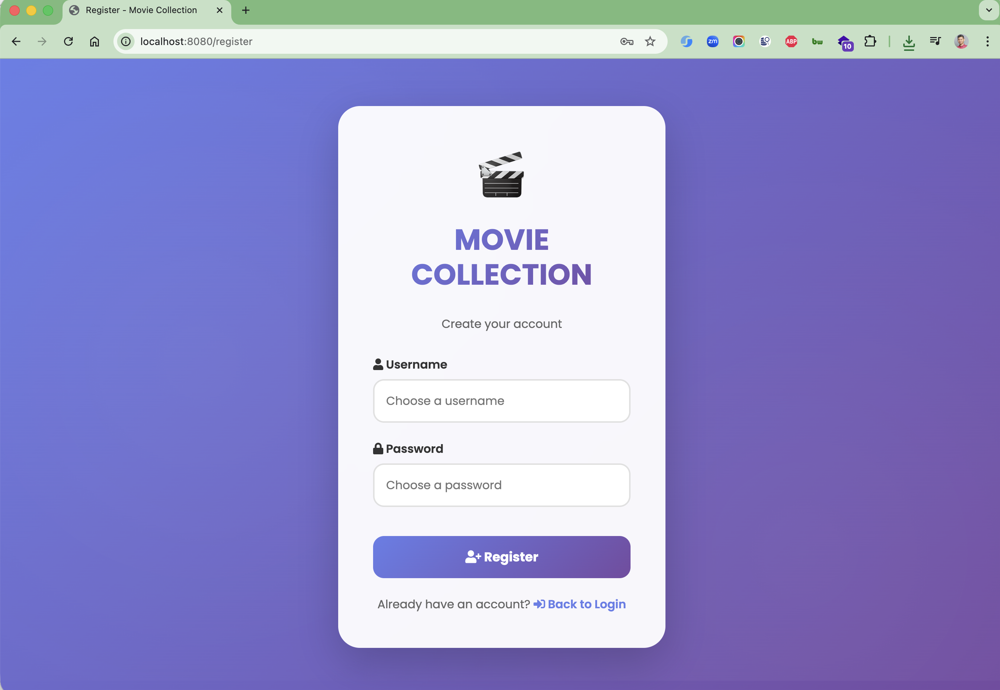
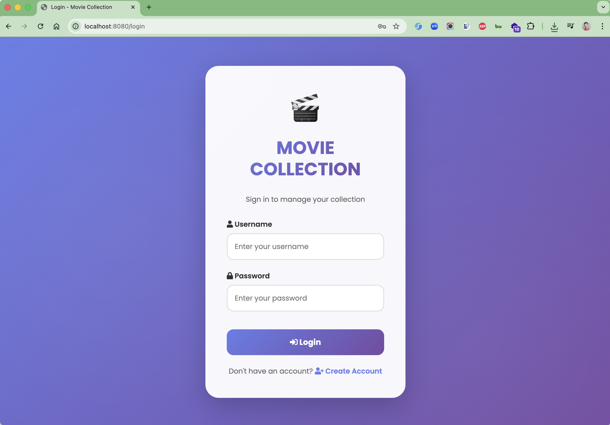
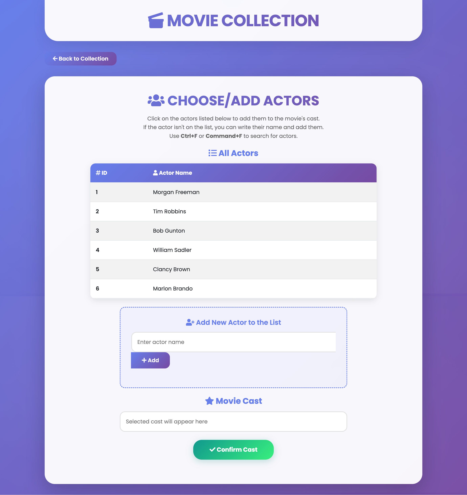

# Movie Collections

A comprehensive movie management application built with Spring Boot that allows users to manage movie collections,
actors, and cast information with role-based access control.

## 📋 Table of Contents

- [Features](#features)
- [Technology Stack](#technology-stack)
- [Prerequisites](#prerequisites)
- [Installation](#installation)
- [Configuration](#configuration)
- [Database Schema](#database-schema)
- [API Endpoints](#api-endpoints)
- [Security](#security)
- [Usage](#usage)
- [Testing](#testing)
- [Contributing](#contributing)
- [License](#license)

## Image Screenshot

Register Page



Login Page



List Actors


Edit Actor



## ✨ Features

### Core Features

- **Movie Management**: Create, read, update, and delete movie records
- **Actor Management**: Manage actor information and their filmography
- **Cast Management**: Associate actors with movies and manage cast relationships
- **User Authentication**: Secure login system with role-based access
- **Role-based Authorization**: Different permissions for users and administrators
- **Search Functionality**: Search movies by name, category, or actor
- **Responsive UI**: Clean Thymeleaf-based web interface
- **RESTful API**: Complete REST API for programmatic access

### User Roles

- **USER**: Can view movie lists and details
- **ADMIN**: Full access to create, edit, and delete movies and manage cast

## 🛠 Technology Stack

### Backend

- **Java 21**: Latest LTS version
- **Spring Boot 3.5.5**: Main framework
- **Spring Data JPA**: Data persistence layer
- **Spring Security 6**: Authentication and authorization
- **Hibernate 6**: ORM framework
- **H2 Database**: In-memory database for development
- **Maven**: Dependency management and build tool

### Frontend

- **Thymeleaf**: Server-side templating engine
- **HTML5/CSS3**: Frontend markup and styling
- **JavaScript**: Client-side interactions
- **Bootstrap**: UI components and responsive design

### Development Tools

- **Lombok**: Reducing boilerplate code
- **Spring Boot DevTools**: Development productivity
- **Spring Boot Actuator**: Application monitoring
- **JUnit 5**: Unit testing framework

## 📋 Prerequisites

- **Java**: JDK 21 or higher
- **Maven**: 3.6+ for building the project
- **Git**: For version control

## 🚀 Installation

### 1. Clone the Repository

```bash
git clone https://github.com/hendisantika/Movie-Collections.git
cd Movie-Collections
```

### 2. Build the Project

```bash
mvn clean install
```

### 3. Run the Application

```bash
mvn spring-boot:run
```

### 4. Access the Application

- **Web Interface**: http://localhost:8080
- **H2 Console**: http://localhost:8080/h2-console
- **Actuator Endpoints**: http://localhost:8080/actuator

## ⚙️ Configuration

### Application Properties

Key configuration settings in `application.properties`:

```properties
# JPA/Hibernate Configuration
spring.jpa.hibernate.ddl-auto=none
spring.jpa.properties.hibernate.show_sql=true
spring.jpa.properties.hibernate.format_sql=true
# Security Configuration
spring.security.user.password=12345
# Thymeleaf Configuration
spring.thymeleaf.check-template-location=true
spring.thymeleaf.prefix=classpath:/templates/
spring.thymeleaf.suffix=.html
# Actuator Configuration
management.endpoints.web.exposure.include=*
management.endpoint.shutdown.enabled=true
```

## 🗄️ Database Schema

The application uses the following main entities:

### Movies Table (`t_movies`)

- `id` (BIGINT, Primary Key)
- `name` (VARCHAR)
- `release_date` (DATE)
- `category` (VARCHAR)
- `description` (TEXT)
- `image` (VARCHAR)
- `rating` (FLOAT)

### Actors Table (`t_actors`)

- `actor_id` (BIGINT, Primary Key)
- `actor_name` (VARCHAR)

### Users Table (`users`)

- `username` (VARCHAR, Primary Key)
- `password` (VARCHAR)
- `enabled` (BOOLEAN)

### Authorities Table (`authorities`)

- `username` (VARCHAR)
- `authority` (VARCHAR)

### Junction Table (`movie_actors`)

- Many-to-many relationship between movies and actors

## 🌐 API Endpoints

### Web Controllers

#### Movie Management

- `GET /` - Home page
- `GET /movies/list` - List all movies (USER role required)
- `GET /movies/new` - New movie form (ADMIN role required)
- `POST /movies/new` - Create new movie (ADMIN role required)
- `GET /movies/edit/{id}` - Edit movie form (ADMIN role required)
- `POST /movies/update/{id}` - Update movie (ADMIN role required)
- `GET /movies/delete/{id}` - Delete movie (ADMIN role required)

#### Authentication

- `GET /login` - Login page
- `GET /register` - Registration page
- `POST /register` - Process registration
- `GET /logout` - Logout

### REST API Endpoints

#### Movies API

- `GET /api/movies` - Get all movies
- `GET /api/movies/{id}` - Get movie by ID
- `GET /api/movies/search?name={name}` - Search movies by name
- `GET /api/movies/category/{category}` - Get movies by category
- `GET /api/movies/actor/{actor}` - Get movies by actor name

#### Actors API

- `GET /api/actors` - Get all actors
- `GET /api/actors/{id}` - Get actor by ID

## 🔒 Security

### Authentication

- Form-based authentication with custom login page
- Password encoding using Spring Security's default encoder
- Session-based authentication

### Authorization

- **Public Access**: Home page, login, register, static resources
- **USER Role**: View movie lists and details
- **ADMIN Role**: Full CRUD operations on movies and cast management

### Security Configuration

- CSRF protection enabled for forms
- H2 Console access configured for development
- Custom security filter chains for different URL patterns

## 📖 Usage

### For End Users

1. **Registration**: Create an account via `/register`
2. **Login**: Access the system via `/login`
3. **Browse Movies**: View movie collections at `/movies/list`
4. **Search**: Use search functionality to find specific movies

### For Administrators

1. **Movie Management**: Add, edit, or delete movies
2. **Cast Management**: Associate actors with movies
3. **User Management**: Manage user accounts and roles

### API Usage

```bash
# Get all movies
curl -X GET http://localhost:8080/api/movies

# Search movies by name
curl -X GET "http://localhost:8080/api/movies/search?name=Avatar"

# Get movies by category
curl -X GET http://localhost:8080/api/movies/category/Action
```

## 🧪 Testing

### Run Unit Tests

```bash
mvn test
```

### Run with Coverage

```bash
mvn test jacoco:report
```

### Test Database

The application uses H2 in-memory database for testing, ensuring tests are isolated and repeatable.

## 🤝 Contributing

1. Fork the repository
2. Create a feature branch (`git checkout -b feature/amazing-feature`)
3. Commit your changes (`git commit -m 'Add some amazing feature'`)
4. Push to the branch (`git push origin feature/amazing-feature`)
5. Open a Pull Request

### Development Guidelines

- Follow Java coding standards
- Write unit tests for new features
- Update documentation as needed
- Ensure all tests pass before submitting PR

## 📞 Contact

- **Author**: Hendi Santika
- **Email**: hendisantika@gmail.com
- **Telegram**: @hendisantika34
- **GitHub**: [hendisantika](https://github.com/hendisantika)

## 📄 License

This project is licensed under the MIT License - see the [LICENSE](LICENSE) file for details.

## 🚀 Deployment

### Local Development

```bash
mvn spring-boot:run
```

### Production Build

```bash
mvn clean package
java -jar target/movie-collection-0.0.1-SNAPSHOT.jar
```

### Docker Support

```dockerfile
FROM openjdk:21-jre-slim
COPY target/movie-collection-0.0.1-SNAPSHOT.jar app.jar
EXPOSE 8080
ENTRYPOINT ["java","-jar","/app.jar"]
```

## 📈 Future Enhancements

- [ ] Add movie ratings and reviews system
- [ ] Implement file upload for movie posters
- [ ] Add pagination for large datasets
- [ ] Integration with external movie APIs (TMDB, IMDB)
- [ ] Email notifications for new releases
- [ ] Advanced search filters
- [ ] Export functionality (PDF, CSV)
- [ ] Mobile application support
